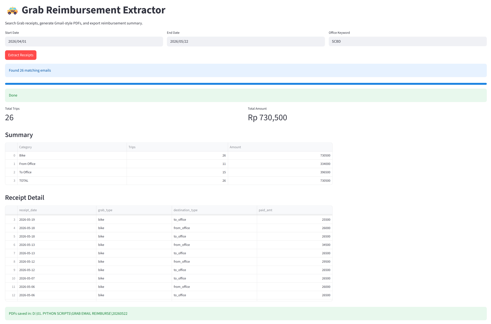
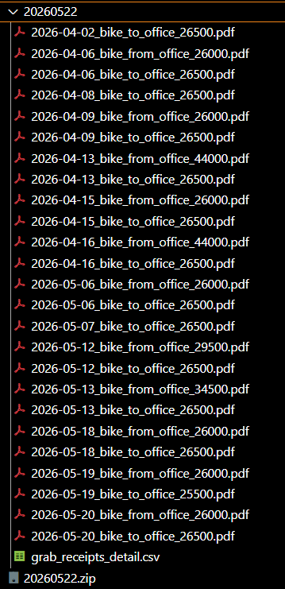

# Grab Email Reimbursement Extractor

Simple tool to extract Grab e-receipts from Gmail for reimbursement purposes.

## What it does

- Search Gmail for Grab receipts
- Convert emails into Gmail-style PDF receipts
- Extract:
  - receipt date
  - grab type (`bike` / `car`)
  - destination type (`to_office` / `from_office`)
  - paid amount
- Generate:
  - detailed CSV
  - summary CSV
  - ZIP file containing all PDFs

Example PDF filename:

```text
2026-05-22_bike_from_office_26000.pdf
```

---

## Setup

Install dependencies:

```bash
pip install streamlit pandas google-auth google-auth-oauthlib google-api-python-client playwright tqdm
```

Install Playwright browser:

```bash
playwright install
```

---

## Gmail API Setup

1. Create a Google Cloud project
2. Enable Gmail API
3. Configure OAuth consent screen
4. Add yourself as a test user
5. Create OAuth Desktop App credentials
6. Download credentials JSON as:

```text
cred.json
```

Generate token:

```bash
python generate_token.ipyb
```

This creates:

```text
token.json
```

---

## Run

```bash
streamlit run app.py
```

---

## Output

ZIP contains:

```text
2026-05-22_bike_from_office_26000.pdf
2026-05-23_car_to_office_54000.pdf
grab_receipts_detail.csv
```



Example Output:



---

## Notes

- Intended for personal reimbursement automation
- Do not commit credentials to Git